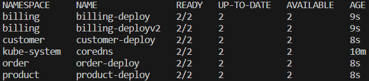
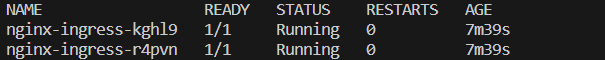
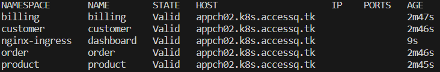
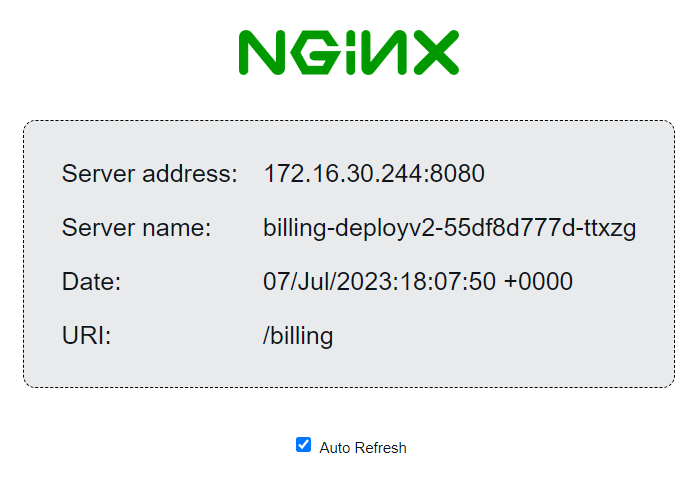

# Kubernetes-IC
- Para el despliegue del cluster se utilizo la herramienta Kops, que es una herramienta de línea de comandos para el 
aprovisionamiento automatizado de clústeres de Kubernetes,  la cual se encuentra entre las mejores practicas recomendadas junto 
con kubeadm, kubespray, Rke y Puppet.  Para la creacion del cluster ejecutar el archivo template.yaml que se encuentra dentro de 
la carpeta kops.

- Se creó 5 namespaces: billing, product, customer y order.

```
ns.yaml

apiVersion: v1
kind: Namespace
metadata:
  name: billing
---
apiVersion: v1
kind: Namespace
metadata:
  name: product
---
apiVersion: v1
kind: Namespace
metadata:
  name: customer
---
apiVersion: v1
kind: Namespace
metadata:
  name: order
---
apiVersion: v1
kind: Namespace
metadata:
  name: accessq

```

Para desplegar un manifiesto en kubernetes se utiliza el siguiente formato:

```
kubectl create -f <nombre-del-manifiesto>.yaml
```
Entonces, para el manifiesto que los namespaces se utilizó :
```
kubectl create -f ns.yaml
```

Verificar que los namespaces hayan sido desplegados en el cluster, mediante el siguiente comando: 

```
kubectl get namespace
```

Luego, en cada namespace se crea 1 deployment de dos replicas o pods utilizando la imagen nginxdemos/nginx-hello, además del 
servicio para exponer cada uno de las aplicaciones.

```

# El manifiesto pertenece al archivo deployv1.yaml, aqui se muestra el caso solo para el namespace billing.

apiVersion: apps/v1
kind: Deployment
metadata:
  name: billing-deploy
  namespace: billing
spec:
  replicas: 2
  selector:
    matchLabels:
      app: billing
  template:
    metadata:
      labels:
        app: billing
    spec:
      containers:
        - name: billing
          image: nginxdemos/nginx-hello
          ports:
            - containerPort: 8080
---
apiVersion: v1
kind: Service
metadata:
  name: billing-svc
  namespace: billing
spec:
  ports:
    - port: 80
      targetPort: 8080
      protocol: TCP
      name: http
  selector:
    app: billing

```
Luego verificamos que los deployments este corriendo y en sus respectivos namespaces, deberia obtener un resultado similar a 
este: 



## Despliegue del Nginx Ingress Controller

- En la implementacion del ingress controller de NGINX mediante manifiestos se utilizo la guia oficial del NGINX, que se 
encuentra en este enlace [ Nginx Ingress Controller ] (https://docs.nginx.com/nginx-ingress-controller/installation/
installation-with-manifests/). Existe dos formas de desplegar el ingress controller: mediante deployment o daemonset. Se utilizo 
el daemonset para el despliegue. Una vez hecho los pasos del enlace, revise que los pods del ingress controller tengan un status 
``running`` mediante el siguiente comando: 

```
kubectl get pods -n nginx-ingress (Los pods se crearon en el namespace nginx-ingress)
```
Se deberias observar la siguiente imagen similar en la implementacion.



- Una vez desplegado el NGINX, para dirigir el trafico hacia todas las aplicaciones desplegadas en diferentes namespaces o en 
otras palabras `ruteo de cross namespace`, se necesita utilizar las herramientas de virtualserver y vitualserverroute. 

```
#Manifiesto vsr.yaml 

apiVersion: k8s.nginx.org/v1
kind: VirtualServerRoute
metadata:
  name: customer
  namespace: customer
spec:
  host: appch01.k8s.accessq.tk
  upstreams:
    - name: customer
      service: customer-svc
      port: 80
  subroutes:
    - path: /customer
      action:
        pass: customer

```
Del despliegue mostrado arriba, se observa que se utilizo el subdominio appch01.k8s.accessq.tk como host. Este fue habilitado 
como un registro desde un dominio de Amazon gestionado mediante el servicio Route 53. Ademas, se utilizo el path customer para 
la redireccion de trafico hacia esta aplicacion. De la misma forma se desplego para las demas aplicaciones. 

```
# Manifiesto virtualserver.yaml

apiVersion: k8s.nginx.org/v1
kind: VirtualServer
metadata:
  name: accessq
  namespace: accessq
spec:
  host: appch01.k8s.accessq.tk
  tls:
    secret: server-secret
    redirect:
      enable: true
  routes:
    - path: /billing
      route: billing/billing
    - path: /product
      route: product/product
    - path: /customer
      route: customer/customer
    - path: /order
      route: order/order 
```

El virtualserver es deplegado en el namespace accessq y permite redirigir el trafico a traves de todas las routes especificadas 
en el virtualserverroute desplegado anteriormente. En la seccion de ``routes`` se coloca el path y la ruta que presenta el 
formato de: ``/nombre del namespace/nombre del pod``. Finalmente despliege los manifiestos y verifique que los virtualserver y 
virtualserverroute se encunetren validos. 



Observacion: Para habilitar el host del virtualserver usted necesita crear 1 registro de un dominio que posea en AWS, en este 
caso se utilizo un dominio comprado de Amazon, pero usted puede utilizar dominios de diferentes proveedores. Este registro debe 
dirigir su trafico al NLB que se creo en el despliege del nginx. Además, necesita activar la configuracion de proxy-protocol v2 
para cada uno de los targets del balanceador. 

- El traffic splitting/canary testing es un escenario donde se divide el traffico a una determinada aplicacion antes de 
desplegar al usuario una nueva version de esta. El objetivo de este metodo es probar la correcta funcionalidad de la aplicacion 
antes de su uso final. Para realizar este escenario desplegamos dos pods dentro del namespace billing, la cual llamararemos 
billingv2. 

```
# manifiesto deployv2.yaml

apiVersion: apps/v1
kind: Deployment
metadata:
  name: billing-deployv2
  namespace: billing
spec:
  replicas: 2
  selector:
    matchLabels:
      app: billingv2
  template:
    metadata:
      labels:
        app: billingv2
    spec:
      containers:
        - name: billingv2
          image: nginxdemos/nginx-hello
          ports:
            - containerPort: 8080
---
apiVersion: v1
kind: Service
metadata:
  name: billing-svcv2
  namespace: billing
spec:
  ports:
    - port: 80
      targetPort: 8080
      protocol: TCP
      name: http
  selector:
    app: billingv2
```

Una vez desplegado este manifiesto tenemos una nueva version de la aplicacion billing, luego se modifica el virtualserverroute 
en la ruta de billing.

```
apiVersion: k8s.nginx.org/v1
kind: VirtualServerRoute
metadata:
  name: billing
  namespace: billing
spec:
  host: test.k8s.accessq.tk #appch01.k8s.accessq.tk
  upstreams:
    - name: billing
      service: billing-svc
      port: 80
    - name: billingv2
      service: billing-svcv2
      port: 80
  subroutes:
    - path: /billing
      splits:
        - weight: 10
          action:
            pass: billing
        - weight: 90
          action:
            pass: billingv2
```

Una vez modificado el manifiesto, ejecute el siguiente comando para su despliege. 

```
kubectl apply -f vsr.yaml
```
Nginx te permite simular el canary testing al agregar el comando splits en la configuracion del virtualserverroute. Ademas de 
poder establecer un equivalente a cuanto trafico se requiere que pase a cada una de las versiones, como fin de prueba. En el 
caso anterior vemos que un 10% se dirige a la version 1 y el 90% a la version 2. 

Finalmente, ingrese en el buscador la direccion del host usado mas el protocolo http o https: https://test.k8s.accessq.tk. Para 
ingresar a las aplicaciones adicione los paths que se habilitaron : /billing, /customer, /product y /order. 




Verifique el balanceo en todas las aplicaciones y el traffic splitting en la aplicacion billing ingresando al path: /billing. 
